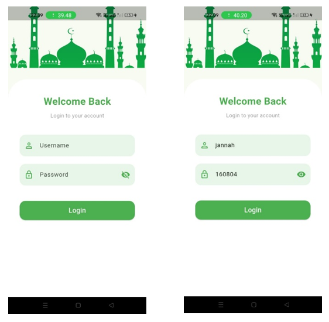
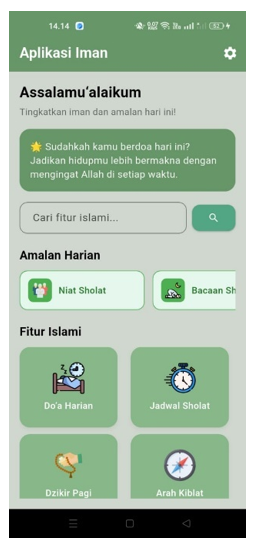
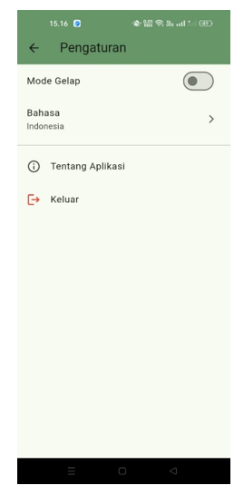
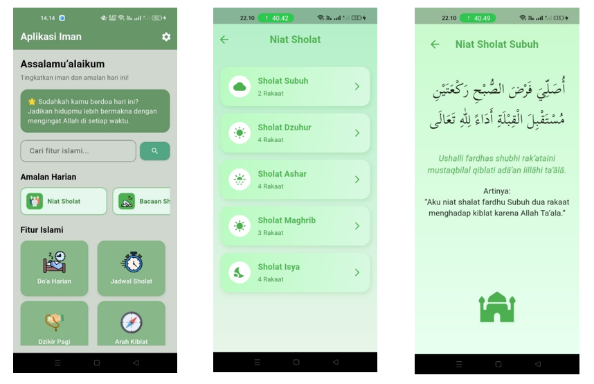

# 🕌 Aplikasi Islami - Panduan Ibadah Muslim  
📱 **Mata Kuliah:** Mobile Programming (UTS 2025/2026)  
Dikembangkan menggunakan **Flutter Framework**

---

## 📋 Deskripsi Aplikasi
Aplikasi Islami ini dirancang untuk membantu umat Muslim dalam menjalankan ibadah harian.  
Fitur-fitur di dalamnya mencakup **Al-Qur'an, Doa Harian, Niat Sholat, Niat Puasa, Dzikir, Arah Kiblat, Jadwal Sholat**, dan lainnya.  
Aplikasi ini menampilkan data menggunakan **data dummy lokal (JSON/statis)** dan menerapkan sistem **navigasi antarhalaman berbasis Flutter**.

---

## 🎯 Tujuan
- Menyediakan referensi ibadah harian dalam satu aplikasi mobile.  
- Melatih penerapan konsep **layout, widget, dan routing** di Flutter.  
- Menjadi dasar pengembangan ke tahap **integrasi API (real data)** di masa mendatang.

---

## 🧩 Struktur Folder Utama

lib/
┣ alquran/ → Menampilkan daftar surah dan detail ayat Al-Qur’an.
┣ arahqiblat/ → Menentukan arah kiblat menggunakan sensor kompas.
┣ bacaan_sholat/ → Menampilkan bacaan dan urutan sholat lengkap.
┣ ceritanabi/ → Menampilkan kisah para nabi sebagai media pembelajaran.
┣ doaharian/ → Menampilkan kumpulan doa-doa harian.
┣ dzikirharian/ → Menampilkan bacaan dzikir pagi dan petang.
┣ hadist/ → Menampilkan kumpulan hadist pilihan.
┣ jadwalsholat/ → Menampilkan jadwal sholat harian.
┣ login/ → Menyediakan halaman login atau autentikasi pengguna.
┣ niatpuasa/ → Menampilkan niat puasa wajib dan sunnah.
┣ niatsholat/ → Menampilkan niat sholat wajib dan sunnah.
┣ niatwudhu/ → Menampilkan niat berwudhu sebelum sholat.
┣ setting/
┣ utama/ → Berisi halaman utama (home) dan navigasi awal aplikasi.
┣ widgets/ → Menyimpan komponen UI seperti card, tombol, dan layout custom.
┗ main.dart → Titik masuk utama aplikasi Flutter (fungsi main()).

assets/
┣ fonts/ → Menyimpan font custom (Scheherazade-Regular.ttf untuk teks Arab).
┗ icon/ → Menyimpan ikon (.png/.svg) yang digunakan dalam aplikasi.

## ⚙️ Teknologi & Dependensi
Aplikasi ini dikembangkan menggunakan **Flutter SDK** dengan beberapa package berikut:
```yaml
dependencies:
  flutter:
    sdk: flutter
  intl: ^0.19.0
  vibration: ^1.8.4
  audioplayers: ^6.1.0
  flutter_compass: ^0.8.0
  http: ^1.1.0
📦 Keterangan:
- intl → Format waktu & tanggal
- vibration → Efek getar saat interaksi
- audioplayers → Pemutar suara atau audio
- flutter_compass → Menentukan arah kiblat
- http → Persiapan integrasi API

🧭 Navigasi Aplikasi
Navigasi antarhalaman dilakukan menggunakan Navigator.push().
Berikut daftar halaman utama beserta fungsinya:

1. Home
    File: utama/home_page.dart
    Fungsi: Menampilkan menu utama aplikasi.
2. Al-Qur’an
    File: alquran/alquran_page.dart
    Fungsi: Menampilkan daftar surah dan halaman detail surah.
3. Doa Harian
    File: doaharian/doa_harian_page.dart
    Fungsi: Menampilkan kumpulan doa harian.
4. Niat Sholat
    File: niatsholat/niat_sholat_page.dart
    Fungsi: Menampilkan daftar niat sholat wajib dan sunnah.
5. Niat Puasa
    File: niatpuasa/niat_puasa_page.dart
    Fungsi: Menampilkan niat puasa wajib dan sunnah.
6. Arah Kiblat
    File: arahqiblat/arah_kiblat_page.dart
    Fungsi: Menentukan arah kiblat menggunakan sensor kompas.
7. Jadwal Sholat
    File: jadwalsholat/jadwal_sholat_page.dart
    Fungsi: Menampilkan waktu sholat sesuai hari.

🖋️ Desain & Font
Menggunakan font Scheherazade-Regular.ttf untuk tampilan teks Arab.
Ikon disimpan dalam folder assets/icon/.
Tema warna dominan: Hijau dan Putih (memberikan kesan islami, bersih, dan nyaman dipandang).
Layout menggunakan kombinasi widget Container, Column, Row, ListView, dan Card untuk menjaga responsivitas dan keteraturan tampilan.

📸 Screenshot Implementasi Aplikasi
Berikut adalah tampilan dari beberapa halaman pada aplikasi beserta deskripsinya:
🧑‍💻 Gambar 1 — Halaman Login
Digunakan sebagai gerbang awal aplikasi untuk proses masuk sebelum ke halaman utama.
Menampilkan form input sederhana dan tombol untuk melanjutkan ke Home.


🏠 Gambar 2 — Halaman Home (Beranda)
Menampilkan fitur-fitur utama seperti Doa Harian, Jadwal Sholat, Dzikir, Arah Kiblat, dan lainnya.
Terdapat pencarian fitur, kartu motivasi, dan UI responsif dengan ListView & GridView.


⚙️ Gambar 3 — Halaman Setting
Fungsi untuk mengganti Bahasa (Indonesia/English) dan Dark Mode.
State UI dikelola memakai Provider, sehingga perubahan langsung diterapkan.


📿 Gambar 4 — Halaman Niat Sholat
Berisi daftar niat sholat yang ditampilkan dengan format Arab, Latin, dan Terjemahan.


